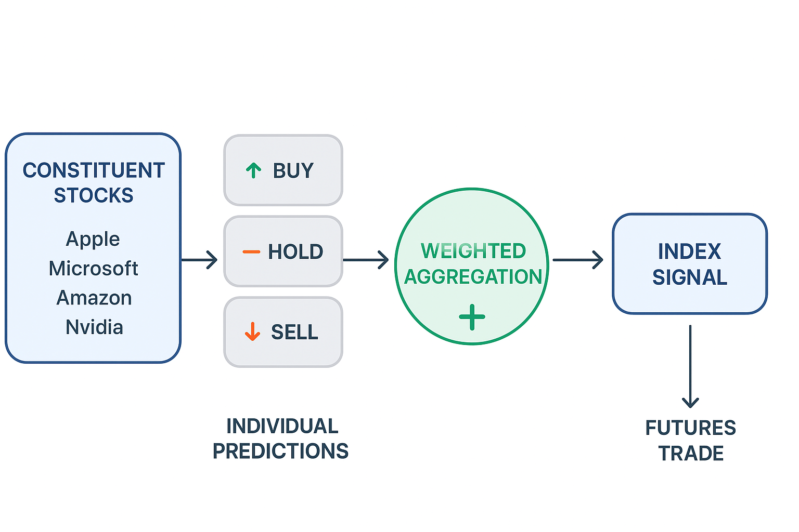

## 📈 Market Master — Component-Weighted Hourly Index Prediction MLOps Pipeline

<div align="center">
  
</div>

A complete end-to-end machine learning pipeline that predicts the next-hour trading action for each major stock in an index, then combines these into a single weighted signal for the index itself (e.g., NASDAQ-100 → /NQ). The system uses historical price data, technical indicators, and a trained model to give clear buy, sell, or hold signals for index futures trading.

---

## Problem
Index futures like NASDAQ-100 (/NQ) are a popular way to trade the overall direction of the market, especially for tech-heavy portfolios. The index is made up of many constituent stocks — companies like Apple, Microsoft, Amazon, and Nvidia — each assigned a specific weight based on its market value. Larger companies influence the index more. Traders watch the index because it acts as a single benchmark for multiple companies, but its movement is really the result of all constituents combined.

Manually tracking dozens of stocks, calculating indicators, and then deciding the next move for the index is challenging. Each stock may give different signals, and without a structured way to combine them, decisions can be slow, inconsistent, and prone to emotional bias.

## Solution
Our system automates this process using machine learning and a clear aggregation method. Every hour, we collect OHLCV (Open, High, Low, Close, Volume) data for the top-weighted NASDAQ-100 stocks. For each stock, we compute technical features and indicators, then predict the next hour’s price movement using a trained model. Each prediction is mapped to a score — from strong buy to strong sell — and weighted according to the stock’s influence in the index.

These weighted scores are combined into a Weighted Sentiment Score (WSS), representing the predicted direction of the index for the next hour. If the WSS exceeds a buy threshold, we issue a “buy” signal for index futures; if it falls below a sell threshold, we issue a “sell” signal; otherwise, we hold.

This approach ensures consistent, data-driven decisions, removes human guesswork, and allows traders to act confidently on the likely direction of the index in the coming hour — ideal for trading index derivatives.

### Solution overview 
- 1‑hour OHLCV for index constituents (top‑10 QQQ in MVP).
- Pooled training across constituents with a symbol feature; multiple candidates compared; champion selected.
- Per‑symbol predictions aggregated to WSS to emit an /NQ signal; logged to MLflow.
- Champion served via FastAPI, loading from MLflow Model Registry alias `@Production`.

### 💼 Business impact
- **Consistency in decisions**: Clear actions (strong_sell/sell/hold/buy/strong_buy) per constituent reduce emotional noise.
- **Operational efficiency**: Automates multi‑indicator synthesis; hourly index‑level signal for faster decisioning.
- **Risk awareness**: Per‑class probabilities enable confidence‑based thresholds and risk controls.
- **Path to scale**: Structure extends to full NASDAQ‑100, registry‑based promotion, and cloud later.

## 🚀 Features
- Pooled training and model comparison (RF/ET/GB/HGBT/MLP/SVC/LogReg) with MLflow nested runs; champion persisted.
- MLflow Model Registry integration with aliases (Staging/Production); API serves `models:/market-master-component-classifier@Production`.
- Per‑symbol predictions and WSS aggregation for index signal; logs artifacts/metrics to MLflow.
- Monitoring with Evidently (drift and classification quality); gating criteria and promotion utility.
- FastAPI with `/health`, `GET /predict/component`, `GET /signal/index`, and `POST /predict`.

---

## 🛠️ Stack

| Layer            | Tool(s)                                                                              |
|------------------|--------------------------------------------------------------------------------------|
| 🧠 Model         | scikit‑learn candidates (RF/ET/GB/HGBT/MLP/SVC/LogReg), LabelEncoder                 |
| ⚙️ Features      | pandas, NumPy (returns, rolling stats, RSI‑like, MA, ATR, BB width)                  |
| 📊 Monitoring    | Evidently                                                                            |
| ⚙️ Orchestration | Prefect 2 (task-based workflow orchestration) |
| 📦 Tracking      | MLflow (SQLite) + Model Registry with aliases                                         |
| 🌐 API           | FastAPI + Uvicorn                                                                    |
| 🛢️ Storage       | Local files (CSV, `artifacts/`, `mlruns/`)                                           |
| 🧪 Testing       | pytest                                                                               |
| 🐳 Containerization | Docker + Docker Compose (API + MLflow UI)                                           |
| 🔄 CI/CD         | GitHub Actions (tests, linting, pipeline smoke test)                                 |

---

## 📊 Models & Metrics

- **Target**: 5‑class action: {strong_sell, sell, hold, buy, strong_buy}.
- **Candidates**: Random Forest (RF), Extra Trees (ET), Gradient Boosting (GB), Histogram Gradient Boosting (HGBT), Multi-layer Perceptron (MLP), Support Vector Classifier (SVC), and Logistic Regression (LogReg) trained on pooled dataset (one‑hot `symbol`).
- **Features**: log‑returns, rolling mean/volatility, RSI‑like momentum, MAs (short/long), ATR, Bollinger Band width, range ratios.
- **Selection**: All candidates are evaluated using macro F1 score on a time-based split (latest 20% of data for validation). The model with the highest macro F1 score is selected as the champion. In case of ties, accuracy is used as a tiebreaker.
- **Champion Deployment**: The winning model is automatically registered in MLflow Model Registry as `market-master-component-classifier` with the `Staging` alias. After passing quality gates (drift detection and performance thresholds), it's promoted to `Production` alias for serving.
- **Logging (MLflow)**: All training parameters, metrics, and artifacts are logged for each candidate. The champion's model files, metadata, and performance metrics are stored for reproducibility and monitoring.


---

## 🚆 Execution Flow (Local)
1) **Fetch**: QQQ index weights → fetch 1‑hour OHLCV data for top QQQ constituents (AAPL, MSFT, NVDA, AMZN, GOOGL, META, etc.) to `data/components/`.
2) **Features/labels**: rolling indicators and dynamic thresholds; persist metadata.
3) **Train/compare**: candidates on pooled dataset; select champion; log to MLflow and register as Staging.
4) **Predict index**: per‑symbol actions → WSS → /NQ signal; log table/WSS to MLflow.
5) **Monitor**: Evidently drift and classification quality reports; log to MLflow.
6) **Gate**: evaluate drift and F1 thresholds; if pass → promote Staging → Production.
7) **Serve**: API loads Production model via registry.

**Orchestration**: All steps are managed by Prefect tasks with proper logging, error handling, and conditional deployment.


---


## 🐳 Quickstart (Local)

### Option A: Makefile Commands 

1) Clone and enter the repo
```bash
git clone <your-repo-url>
cd market-master-trading-action-prediction
```

2) Create virtual environment
- Windows (PowerShell)
```powershell
py -3.10 -m venv .venv
.venv\Scripts\activate
python -m pip install -U pip
```
- macOS/Linux (bash)
```bash
python3 -m venv .venv
source .venv/bin/activate
python -m pip install -U pip
```

3) Install dependencies
```bash
pip install -r requirements.txt
```

**Note**: The requirements.txt includes both production and development dependencies (black, flake8, isort, mypy, pre-commit) for code quality tools.

4) Run the orchestrated pipeline
```bash
# Run complete orchestrated pipeline
make prefect-flow
```

5) Start monitoring and serving
```bash
# Start MLflow UI for experiment tracking (open in new terminal)
make mlflow-ui

# Start model serving API (open in new terminal)
make model-serving

# Start Prefect server (open in new terminal)
make prefect-start

# Start Streamlit app interactive dashboard (open in new terminal)
make streamlit-dashboard
```

6) Access services
- API: http://localhost:8001/docs (Swagger UI)
- MLflow UI: http://localhost:5000
- Prefect dashboard: http://localhost:4200
- Streamlit dashboard: http://localhost:8501

**🎯 Interactive Dashboard Features:**
- 📈 Real-time stock prices for QQQ constituents
- 🤖 ML-powered individual stock predictions
- 📊 Weighted sentiment score calculation
- 🎯 Futures trading signals (/NQ)
- 📊 Technical analysis and risk metrics
- 🔄 Auto-refresh every 30 seconds

See [dashboard/README.md](dashboard/README.md) for detailed documentation.

**💡 Tip**: See the [Available Commands](#️-available-commands) section below for all available options.

### Option B: Docker Setup (Fully Reproducible)

**This is the recommended approach for full reproducibility and production-like deployment.**

1) Clone and enter the repo
```bash
git clone <your-repo-url>
cd market-master-trading-action-prediction
```

2) **Setup and Start Services**
   ```bash
   # Complete setup (recommended)
   make docker-setup
   
   # Or step by step:
   make docker-build
   make docker-run
   make docker-pipeline
   ```

4) **Access Services**
   - **API Documentation**: http://localhost:8000/docs (Swagger UI)
   - **MLflow UI**: http://localhost:5000 
   - **Streamlit Dashboard**: http://localhost:8501 
   - **Prefect Dashboard**: http://localhost:4200 

5) **Test the Setup**
```bash
   # Test API endpoints
   curl http://localhost:8000/health
   curl "http://localhost:8000/predict/component?symbol=AAPL"
   curl "http://localhost:8000/signal/index?universe=qqq"
   
   # Or use the automated test
   make docker-smoke-test
   ```

**⚠️ Note**: The pipeline requires internet connectivity to fetch stock data from Yahoo Finance. If you encounter data fetching issues, the system will use fallback data for demonstration purposes.

**🎯 What's Included in Option B:**
- **PostgreSQL Database**: Production-grade database for MLflow backend
- **Complete Service Stack**: API, MLflow, Dashboard, and Prefect orchestration
- **Persistent Storage**: All data and artifacts preserved across restarts
- **Health Monitoring**: Automatic health checks for all services
- **Network Isolation**: Dedicated Docker network for security
- **Volume Management**: Proper data persistence and sharing

**🔧 Management Commands:**
```bash
# View service logs
make docker-logs

# Restart services
make docker-restart

# Stop all services
make docker-stop

# Clean up everything
make docker-clean

# Check service health
make docker-health-check
```

**📚 For detailed Docker setup instructions, see [docs/docker_setup.md](docs/docker_setup.md)**

**💡 Tip**: See the [Available Commands](#️-available-commands) section below for all available options.


### 📸 Execution Outputs
For reference, here are screenshots of the system in action:

- **[MLflow Experiments Dashboard](docs/mlflow_experiments.png)** - Experiment tracking and model comparison
- **[MLflow Model Registry](docs/mlflow_models.png)** - Model versioning and promotion workflow
- **[Model Serving API](docs/model-serving-api.png)** - REST API for predictions
- **[Prefect Dashboard](docs/prefect_dashboard.png)** - Workflow orchestration and monitoring


## 🛠️ Available Commands

| Command | Purpose | When to Use |
|---------|---------|-------------|
| `make prefect-flow` | Run complete orchestrated pipeline | **Main command** - Start here |
| `make smoke-test` | Quick pipeline + API test | Testing the system |
| `make clean` | Remove all artifacts and data | Fresh start |
| `make install` | Install dependencies | First time setup |
| `make install-dev` | Install + pre-commit hooks | Development setup |
| `make mlflow-ui` | Start MLflow experiment tracking | Monitor experiments |
| `make model-serving` | Start model serving API | Serve predictions |
| `make model-serving-test` | Test model serving endpoints | Validate API |
| `make streamlit-dashboard` | Start interactive dashboard | Real-time monitoring |
| `make prefect-start` | Start Prefect server | Advanced orchestration |
| `make prefect-worker` | Start Prefect worker | Advanced orchestration |
| `make prefect-deploy` | Deploy scheduled flows | Advanced orchestration |
| `make test` | Run all tests | Quality assurance |
| `make test-unit` | Run unit tests only | Component testing |
| `make test-integration` | Run integration tests only | System testing |
| `make lint` | Run code linting | Code quality |
| `make format` | Format code with black | Code formatting |
| `make type-check` | Run type checking | Code quality |
| `make docker-build` | Build Docker images | Containerization |
| `make docker-run` | Start Docker services | Container deployment |
| `make docker-setup` | Complete Docker setup (Option B) | Full reproducible deployment |
| `make docker-smoke-test` | Test Docker services | Validate deployment |
| `make docker-health-check` | Check service health | Monitor deployment |
| `make docker-logs` | View service logs | Debug deployment |
| `make docker-restart` | Restart services | Service management |
| `make docker-clean` | Clean up Docker resources | Maintenance |
| `make promote-staging` | Promote model to staging | Model management |
| `make rollback-production` | Rollback production model | Model management |


### **Model Serving API Endpoints**
When using `make model-serving`, the following endpoints are available:
- `GET /health` - Health check
- `POST /predict` - Single prediction
- `POST /predict/batch` - Batch predictions
- `GET /model-info` - Model information
- `POST /reload-model` - Reload model from registry

---

7) Sample predictions
- Single component (latest history from CSV):
```bash
curl "http://localhost:8000/predict/component?symbol=NVDA"
```
- Index signal (WSS aggregation):
```bash
curl "http://localhost:8000/signal/index?universe=qqq"
```
- POST /predict with custom bars (requires 21+ bars for warm-up):
```bash
# PowerShell (Windows)
Invoke-RestMethod -Uri "http://localhost:8000/predict" -Method POST -ContentType "application/json" -Body '{
  "symbol": "NVDA",
  "interval": "1h", 
  "bars": [
    {"open": 100.0, "high": 101.0, "low": 99.5, "close": 100.5, "volume": 100000},
    {"open": 100.5, "high": 102.0, "low": 100.0, "close": 101.5, "volume": 120000},
    {"open": 101.5, "high": 103.0, "low": 101.0, "close": 102.5, "volume": 150000},
    {"open": 102.5, "high": 104.0, "low": 102.0, "close": 103.5, "volume": 180000},
    {"open": 103.5, "high": 105.0, "low": 103.0, "close": 104.5, "volume": 200000},
    {"open": 104.5, "high": 106.0, "low": 104.0, "close": 105.5, "volume": 220000},
    {"open": 105.5, "high": 107.0, "low": 105.0, "close": 106.5, "volume": 250000},
    {"open": 106.5, "high": 108.0, "low": 106.0, "close": 107.5, "volume": 280000},
    {"open": 107.5, "high": 109.0, "low": 107.0, "close": 108.5, "volume": 300000},
    {"open": 108.5, "high": 110.0, "low": 108.0, "close": 109.5, "volume": 320000},
    {"open": 109.5, "high": 111.0, "low": 109.0, "close": 110.5, "volume": 350000},
    {"open": 110.5, "high": 112.0, "low": 110.0, "close": 111.5, "volume": 380000},
    {"open": 111.5, "high": 113.0, "low": 111.0, "close": 112.5, "volume": 400000},
    {"open": 112.5, "high": 114.0, "low": 112.0, "close": 113.5, "volume": 420000},
    {"open": 113.5, "high": 115.0, "low": 113.0, "close": 114.5, "volume": 450000},
    {"open": 114.5, "high": 116.0, "low": 114.0, "close": 115.5, "volume": 480000},
    {"open": 115.5, "high": 117.0, "low": 115.0, "close": 116.5, "volume": 500000},
    {"open": 116.5, "high": 118.0, "low": 116.0, "close": 117.5, "volume": 520000},
    {"open": 117.5, "high": 119.0, "low": 117.0, "close": 118.5, "volume": 550000},
    {"open": 118.5, "high": 120.0, "low": 118.0, "close": 119.5, "volume": 580000},
    {"open": 119.5, "high": 121.0, "low": 119.0, "close": 120.5, "volume": 600000},
    {"open": 120.5, "high": 122.0, "low": 120.0, "close": 121.5, "volume": 620000},
    {"open": 121.5, "high": 123.0, "low": 121.0, "close": 122.5, "volume": 650000},
    {"open": 122.5, "high": 124.0, "low": 122.0, "close": 123.5, "volume": 680000},
    {"open": 123.5, "high": 125.0, "low": 123.0, "close": 124.5, "volume": 700000}
  ]
}'

# Bash/Linux/macOS
curl -X POST http://localhost:8000/predict \
  -H "Content-Type: application/json" \
  -d '{
    "symbol": "NVDA",
    "interval": "1h",
    "bars": [
      {"open": 100.0, "high": 101.0, "low": 99.5, "close": 100.5, "volume": 100000},
      {"open": 100.5, "high": 102.0, "low": 100.0, "close": 101.5, "volume": 120000},
      {"open": 101.5, "high": 103.0, "low": 101.0, "close": 102.5, "volume": 150000},
      {"open": 102.5, "high": 104.0, "low": 102.0, "close": 103.5, "volume": 180000},
      {"open": 103.5, "high": 105.0, "low": 103.0, "close": 104.5, "volume": 200000},
      {"open": 104.5, "high": 106.0, "low": 104.0, "close": 105.5, "volume": 220000},
      {"open": 105.5, "high": 107.0, "low": 105.0, "close": 106.5, "volume": 250000},
      {"open": 106.5, "high": 108.0, "low": 106.0, "close": 107.5, "volume": 280000},
      {"open": 107.5, "high": 109.0, "low": 107.0, "close": 108.5, "volume": 300000},
      {"open": 108.5, "high": 110.0, "low": 108.0, "close": 109.5, "volume": 320000},
      {"open": 109.5, "high": 111.0, "low": 109.0, "close": 110.5, "volume": 350000},
      {"open": 110.5, "high": 112.0, "low": 110.0, "close": 111.5, "volume": 380000},
      {"open": 111.5, "high": 113.0, "low": 111.0, "close": 112.5, "volume": 400000},
      {"open": 112.5, "high": 114.0, "low": 112.0, "close": 113.5, "volume": 420000},
      {"open": 113.5, "high": 115.0, "low": 113.0, "close": 114.5, "volume": 450000},
      {"open": 114.5, "high": 116.0, "low": 114.0, "close": 115.5, "volume": 480000},
      {"open": 115.5, "high": 117.0, "low": 115.0, "close": 116.5, "volume": 500000},
      {"open": 116.5, "high": 118.0, "low": 116.0, "close": 117.5, "volume": 520000},
      {"open": 117.5, "high": 119.0, "low": 117.0, "close": 118.5, "volume": 550000},
      {"open": 118.5, "high": 120.0, "low": 118.0, "close": 119.5, "volume": 580000},
      {"open": 119.5, "high": 121.0, "low": 119.0, "close": 120.5, "volume": 600000},
      {"open": 120.5, "high": 122.0, "low": 120.0, "close": 121.5, "volume": 620000},
      {"open": 121.5, "high": 123.0, "low": 121.0, "close": 122.5, "volume": 650000},
      {"open": 122.5, "high": 124.0, "low": 122.0, "close": 123.5, "volume": 680000},
      {"open": 123.5, "high": 125.0, "low": 123.0, "close": 124.5, "volume": 700000}
    ]
  }'
```

**Note**: The POST endpoint requires at least 21 bars of historical data due to rolling window calculations (20-period warm-up + 1 current bar). For daily use, prefer the GET endpoints which use stored CSV data.
Response includes `action` in {"strong_sell","sell","hold","buy","strong_buy"} and per‑class probabilities.

8) Run tests
```bash
# Using Makefile (recommended)
make test              # Run all tests
make test-unit         # Run unit tests only
make test-integration  # Run integration tests only
make test-verbose      # Run tests with verbose output
make test-coverage     # Run tests with coverage report

# Direct pytest commands
pytest -q              # Run all tests
pytest tests/unit/ -q  # Run unit tests only
pytest tests/integration/ -q  # Run integration tests only
pytest tests/integration/ -q
```


---

## ⚙️ Project Structure
```bash
.
├── README.md                        # Main project documentation
├── requirements.txt                 # Python dependencies
├── Makefile                         # Convenience commands for development
├── Dockerfile                       # Containerized API service
├── Dockerfile.dashboard             # Containerized dashboard service
├── docker-compose.yml               # Multi-service orchestration
├── .github/workflows/ci.yml         # GitHub Actions CI/CD
├── docs/                            # Documentation
│   ├── concept_diagram.png          # System architecture diagram
│   ├── mlflow_experiments.png       # MLflow experiments screenshot
│   ├── mlflow_models.png            # Model registry screenshot
│   ├── model-serving-api.png        # API documentation screenshot
│   ├── prefect_dashboard.png        # Prefect dashboard screenshot
│   └── DOCKER_SETUP.md              # Detailed Docker setup guide
├── data/                            # Data storage
│   ├── components/                  # per‑symbol 1h OHLCV CSVs
│   ├── weights/qqq_weights.csv      # normalized QQQ weights (top‑10 in MVP)
│   └── monitoring/                  # Evidently drift and quality reports
├── mlruns/                          # MLflow artifacts (created at run)
├── artifacts/                       # Model artifacts
│   ├── model/                       # Champion model and metadata
│   ├── models/                      # All candidate models
│   ├── index/                       # Index signal outputs
│   └── backtest/                    # Batch backtest results
├── src/                             # Source code
│   ├── features.py                  # indicators (returns, rolling stats, RSI, MA, ATR, BB width)
│   ├── data.py                      # dataset utilities and metadata persistence
│   ├── fetch_symbol.py              # robust yfinance fetcher with market‑hours filter
│   ├── fetch_components.py          # orchestrates multi‑symbol fetch (with sanity checks)
│   ├── fetch_weights_qqq.py         # fetch/normalize QQQ weights (with fallback)
│   ├── model_candidates.py          # candidate estimators for comparison
│   ├── train_pooled_compare.py      # pooled training, MLflow logging, registry registration
│   ├── predict_index.py             # per‑symbol predictions → WSS → index signal (with batch mode)
│   ├── monitor_drift.py             # Evidently drift + classification quality reports
│   ├── gate_and_report.py           # promotion gating and summary
│   ├── registry.py                  # promote/rollback aliases (Staging/Production)
│   ├── run_pipeline.py              # end‑to‑end runner (local orchestration)
│   ├── hourly_predict.py            # hourly scheduler entrypoint (Windows Task Scheduler)
│   └── api.py                       # FastAPI serving (registry‑first model load)
├── flows/                           # Workflow orchestration
│   └── enhanced_orchestration.py    # Prefect flow definition
├── dashboard/                       # Interactive dashboard
│   ├── streamlit_app.py             # Streamlit trading dashboard
│   └── README.md                    # Dashboard documentation
└── tests/                           # Test suite
    ├── unit/                        # Unit tests
    │   ├── test_features.py         # Feature engineering tests
    │   ├── test_pipeline.py         # Pipeline component tests
    │   └── test_mlops.py            # MLOps functionality tests
    ├── integration/                 # Integration tests
    │   └── test_api.py              # API endpoint tests
    └── conftest.py                  # Shared test fixtures
```


---

## ✅ Evaluation Readiness
  The project is structured for easy grading and local execution.

- **Problem description**: Clearly defined 1‑hour constituent signals aggregated to an index decision.
- **Cloud**: Local‑only with Docker containerization for reproducibility.
- **Experiment tracking & registry**: MLflow tracking implemented; Model Registry with aliases implemented.
- **Workflow orchestration**: Prefect 2 task-based orchestration with proper logging, error handling, and conditional deployment.
- **Model deployment**: FastAPI with `/health`, `/predict/component`, `/signal/index`, and `/predict`; loads registry `@Production` model with artifact fallback.
- **Monitoring**: Evidently drift and classification quality reports saved to `data/monitoring/` and logged to MLflow.
- **Reproducibility**: Pinned requirements, deterministic seeds, tests, and Docker containerization.
- **Best practices**: 
  - ✅ **Unit tests**: Comprehensive test suite covering features, pipeline, and MLOps components
  - ✅ **Integration tests**: API endpoint testing with FastAPI TestClient
  - ✅ **Linter and formatter**: Black (code formatting), isort (import sorting), flake8 (linting), mypy (type checking)
  - ✅ **Makefile**: Comprehensive development and deployment commands
  - ✅ **Pre-commit hooks**: Automated code quality checks before commits
  - ✅ **CI/CD pipeline**: GitHub Actions with automated testing, linting, and pipeline smoke tests

---

## 🔧 Configuration (Local)
Environment variables are optional. Defaults are embedded for local use.
- `MLFLOW_TRACKING_URI`: `sqlite:///mlflow.db`
- `MODEL_URI`: `models:/market-master-component-classifier@Production` (API tries this first; falls back to `artifacts/model/model.pkl`)


---

## 🗺️ Roadmap
- Expand to full NASDAQ‑100 constituents and improve symbol metadata.
- Add probability calibration (e.g., Platt scaling) for selected models.
- Tighten gates (delta F1 vs champion, latency SLO) and auto‑rollback on alerts.
- Prefect UI deployment and advanced scheduling features.
- Cloud deployment (AWS/GCP) with managed MLflow and monitoring services.
- Real-time data streaming integration for live trading signals.

## 🤝 Contributing

1. Fork the repository
2. Create a feature branch
3. Make your changes
4. Add tests
5. Submit a pull request


## 📄 License

This project is licensed under the MIT License - see the [LICENSE](LICENSE) file for details.


## 🙏 Acknowledgments

- MLOps Zoomcamp for the foundational knowledge
- The financial community for domain expertise

---

## 📋 Project Status Summary

✅ **Option B Docker Setup Complete**
- **PostgreSQL Database**: Production-grade backend for MLflow
- **Complete Service Stack**: API, MLflow, Dashboard, Prefect
- **Persistent Storage**: Data survives container restarts
- **Health Monitoring**: Automatic health checks
- **Network Isolation**: Secure Docker network
- **Full Reproducibility**: Works identically on any machine

✅ **All Access Points Available**
- **API**: http://localhost:8000/docs
- **MLflow UI**: http://localhost:5000
- **Dashboard**: http://localhost:8501
- **Prefect**: http://localhost:4200

✅ **Production-Ready Features**
- Model registry with staging/production promotion
- Automated pipeline orchestration
- Real-time monitoring and health checks
- Comprehensive logging and error handling

**Ready to experience the power of Market Master in financial prediction? Deploy and monitor your models with confidence!**

